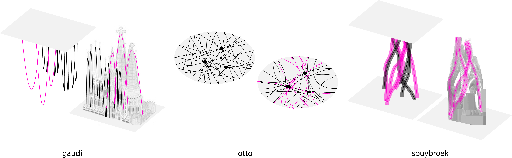
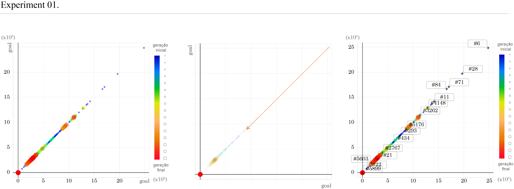
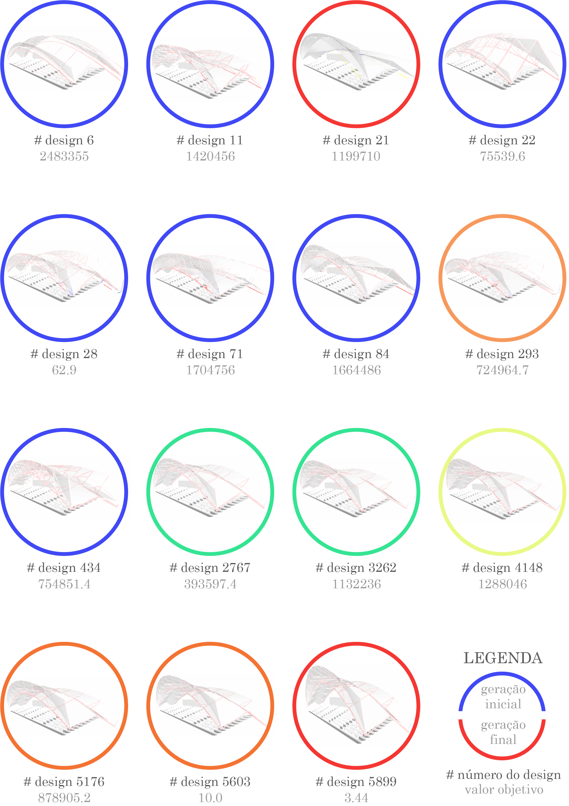
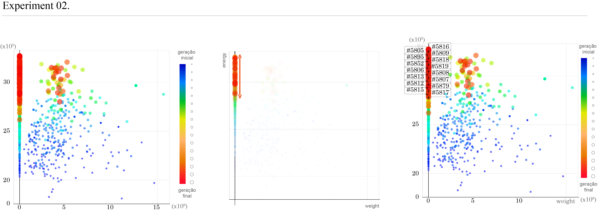
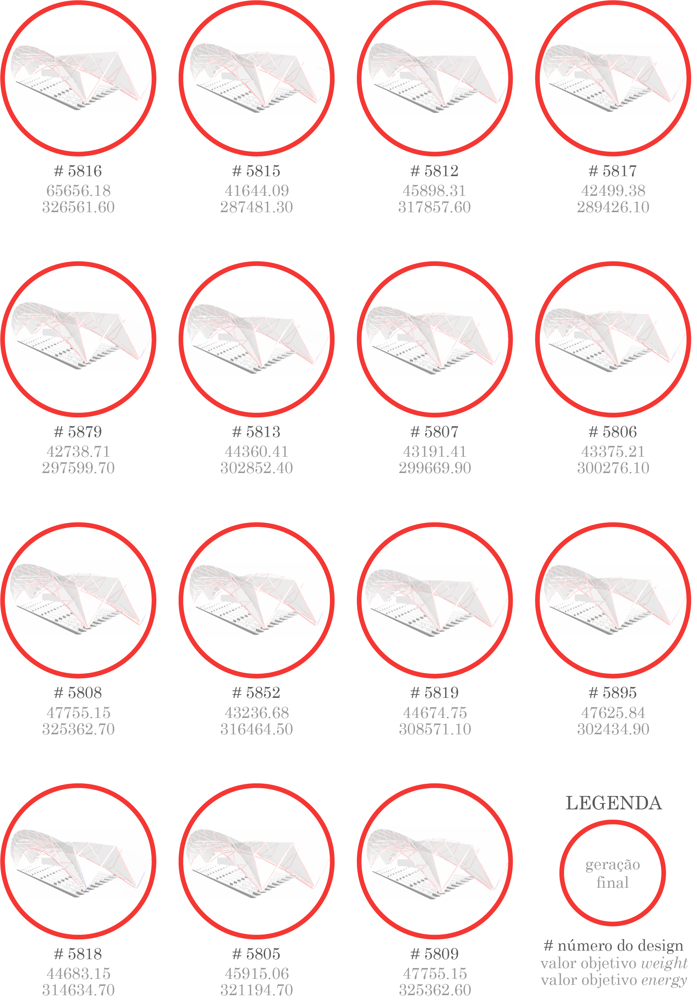

# Generative Design | MECOM
Generative design serves as both a powerful tool and a comprehensive design methodology within the field of metal construction.

### About

A repository consisting of documents, experiments, codes, and theses conducted during the Master's Degree in Metallic Construction at the Department of Civil Engineering, School of Mines, Federal University of Ouro Preto, Brazil, serves as an essential component for fulfilling the requirements to obtain the title of Master in Metallic Construction.

#### Abstrat

Architectural design comprises numerous variables, some of which may be contradictory, requiring constant negotiation. Genetic algorithms offer a technique that contributes to solving such problems by enhancing the search for optimal results. To achieve this, it is sufficient to incorporate genetic algorithms into the generative design system. This study presents the development of a system that combines parametric modeling strategies with genetic algorithms to optimize the total weight of a metallic roof structure and its surface for potential photovoltaic energy generation. By redefining the evolutionary Darwinian process, a systematic project approach was established, enabling architects to engage in problem parameterization beyond mere formal solution propositions. This approach allows for the exploration of a wider range of project possibilities compared to traditional design methods. The research aims to evaluate the potential of genetic algorithms as an integrated auxiliary tool in generative design as a design methodology. The theoretical and practical review of architecture's content focuses on design practices in which architects relinquish specific solution control to access a greater variety of projects. The study applied this process to an architectural design project involving metallic construction and its energy potential. The project demonstrates a collaborative exchange of information between the architect and the design, guided by shared objectives. The experiments reveal that relinquishing control in the final solution formulation occurs through mathematical problem modeling and automated heuristic solution searches. The study also emphasizes a transdisciplinary approach that merges theory and practice, fostering interdisciplinary thinking and overcoming knowledge boundaries in the production of knowledge.

**Key-words:** Generative design, Genetic algorithms, Structural optimization, Environmental optimization, Metallic construction.

### Theoretical reference

1. project as a question - [Caio Adorno Vassão](https://www.blucher.com.br/livro/detalhes/metadesign-620);

2. design and control - [Gaudí](https://en.wikipedia.org/wiki/Antoni_Gaud%C3%AD), [Otto](https://en.wikipedia.org/wiki/Frei_Otto) and [Spuybroek](https://www.nox-art-architecture.com/)

3. design and nature - [Nagy](https://medium.com/generative-design/learning-from-nature-fe5b7290e3de), [Yang](https://www.researchgate.net/publication/235979455_Nature-Inspired_Metaheuristic_Algorithms), [Shiffman](https://natureofcode.com/)

4. design of the design - [Nagy](https://medium.com/generative-design/designing-measures-2c66a71b2ff3)

### Tools

1. [rhinoceros](https://www.rhino3d.com/);

    - [grasshopper 3D](https://www.grasshopper3d.com/page/download-1);
    
      - [karamba 3D](https://www.karamba3d.com/);
        
      - [ladybug](https://www.ladybug.tools/);
      
2. [discover](https://github.com/danilnagy/discover_legacy).

### Strategy:

1. Establishing the design space through construction.

2. Formulating metrics to evaluate the structural and environmental performance.

3. Employing evolutionary algorithms to explore the design space and identify projects with superior performance.

### Implementation, experiments and applying the generative algorithm - the evolutionary solver [Discover](https://github.com/danilnagy/discover_legacy)

### Analysis 

### Results

### The main recommendations for future work are as follows:

1. Methodological development of this study could be enhanced through practical workshops that serve as a platform for reflecting on the adopted method. These workshops would allow testing and discussion with students and professionals, providing valuable insights on how the method would be received by designers.

2. Further exploration of the questions surrounding the definition of problems and who determines what constitutes a problem. This aspect is crucial because an inadequately formulated problem leads to ineffective problem-solving in the project.

3. Increased openness in the design process by involving not only design partners but also future users. Creating opportunities to incorporate users into the process would enable a more inclusive approach. One way to achieve this would be by providing the system with repertoires that guide it towards metadesign.

4. Lastly, it is recommended to explore, discuss, and test this method using non-monetary criteria and parameters for selecting the optimal project. This would present an interesting challenge, as the current work solely focused on criteria such as structural weight and energy generation potential as objectives for the optimization procedures being tested.

### Appendix

Click [here](https://github.com/renatogcruz/generative_design/blob/master/appendx.py).

### Research articles

 [Generative design in the design development of metallic constructions](http://www.proceedings.blucher.com.br/article-details/29707). Nov, 2018

Published in the XXII International Congress of the Ibero-American Society of Digital Graphics.

 [Generative design: information flow between genetic algorithm and parametric design in a steel structure construction](https://www.scielo.br/j/ac/a/f5dkBmGvDYV8hDNgxHRXxYz/abstract/?format=html&lang=en). Out./Dec. 2021

Published in Associação Nacional de Tecnologia do Ambiente Construído, ISSN 1678-8621, Porto Alegre, v. 21, n. 4, p. 271-289.

[Design generativo como ferramenta e metodologia projetual na construção metálica](https://www.repositorio.ufop.br/handle/123456789/10640). Dec. 2018

Master's thesis, Ouro Preto, 2018
