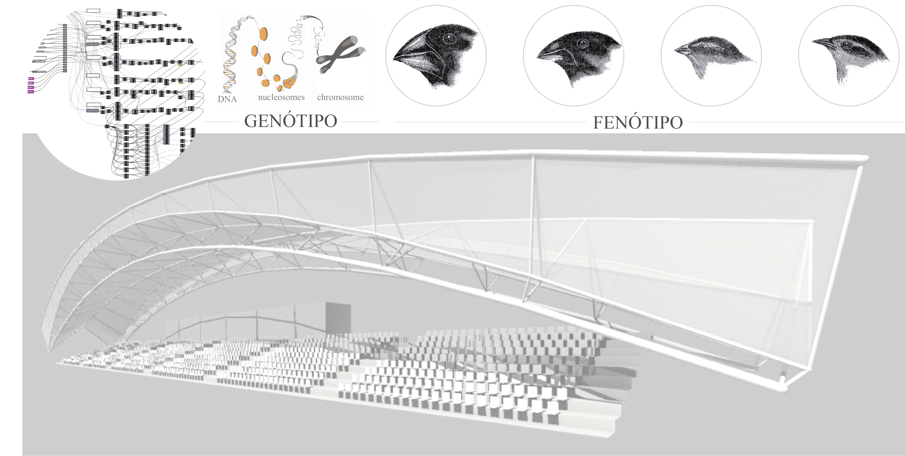
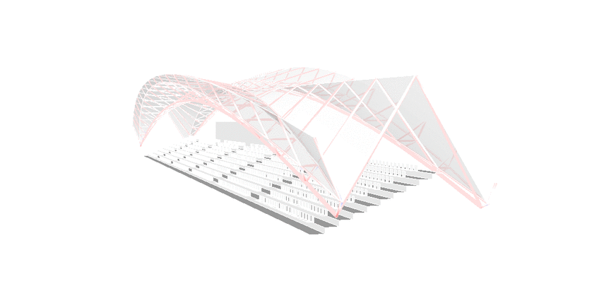
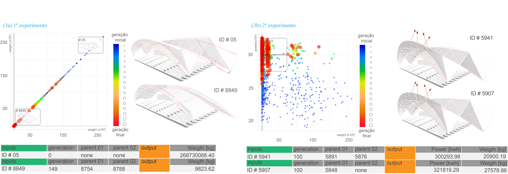

# generative_design_mecom
Generative design in the design development of metallic constructions

### About

Repository of documents, experiments, codes and thesis carried out during the Master's Degree in Metallic Construction of the Department of Civil Engineering of the School of Mines of the Federal University of Ouro Preto, Brazil, as an integral part of the requirements to obtain the title of Master in Construction Metallic.

### Theoretical reference

1. project as a question - [Caio Adorno Vassão](https://www.blucher.com.br/livro/detalhes/metadesign-620);

2. design and control - [Gaudí](https://en.wikipedia.org/wiki/Antoni_Gaud%C3%AD), [Otto](https://en.wikipedia.org/wiki/Frei_Otto) and [Spuybroek](https://www.nox-art-architecture.com/)

3. design and nature - [Nagy](https://medium.com/generative-design/learning-from-nature-fe5b7290e3de), [Yang](https://www.researchgate.net/publication/235979455_Nature-Inspired_Metaheuristic_Algorithms), [Shiffman](https://natureofcode.com/)

4. design of the design - [Nagy](https://medium.com/generative-design/designing-measures-2c66a71b2ff3)

### Tools

1. [rhinoceros](https://www.rhino3d.com/);

    - [grasshopper 3D](https://www.grasshopper3d.com/page/download-1);
    
      - [karamba 3D](https://www.karamba3d.com/);
        
      - [ladybug](https://www.ladybug.tools/);
      
2. [discover](https://github.com/danilnagy/discover_legacy).

### Strategy

1. construction of the design space;

2. development of measures to assess structural and environmental performance;

3. the application of evolutionary algorithms to search the design space and find high performance projects.

### Implementation, experiments and applying the generative algorithm - the evolutionary solver [Discover](https://github.com/danilnagy/discover_legacy)

### Analysis of results

### Final considerations

### Suggestions for future work

The main suggestions for future work are the following suggestions:

1. The methodological development of this work through practical workshops as a reflection on the method adopted, in which it could be tested and discussed with students and professionals, in order to gauge how it would be received by the designers.

2. A deepening of the questions about who defines what is the problem, or what goes into that definition. This issue is important because when a problem is poorly formulated, the project does not solve the problem situation;

3. A greater opening of the design process. In addition to the other agents involved in the design (design partners), the project as a question also opens space to incorporate future users into the process. One of the ways would be to provide this system, more and more, of repertoires that direct it to the metadesign;

4. Finally, to approach, discuss and test this method adopting non-monetary criteria and parameters for choosing the optimal project. This would be an interesting challenge, since this work only adopted criteria (weight of the structure and energy generation potential) as objectives of the optimization procedures tested.

### Appendix

Click [here](https://github.com/renatogcruz/generative_design/blob/master/appendx.py).
